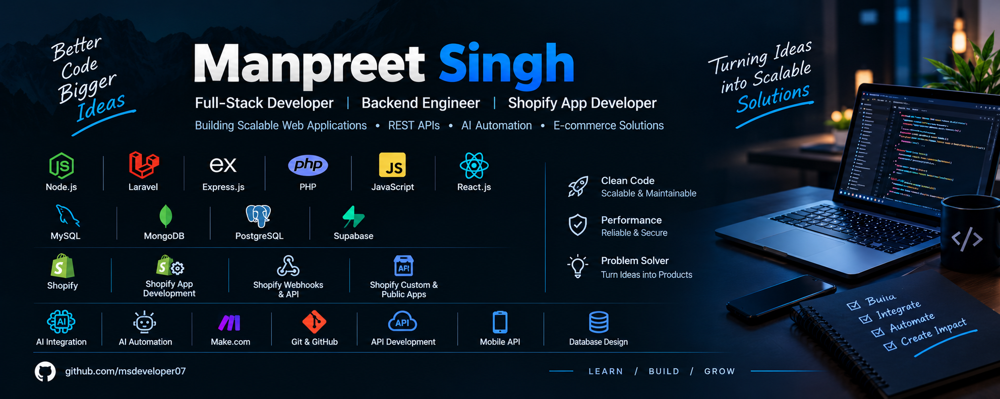

  

# 👋 Hi, I'm Manpreet Singh

### Laravel Developer | AI Automation Engineer | Shopify App Developer

I’m a software developer with **7+ years of experience** building scalable web applications, backend systems, REST APIs, SaaS products, and AI-powered business automation solutions.

My expertise spans **Laravel, PHP, Node.js, API development and integration, database architecture, AI integration, and Shopify app development**. I help businesses transform ideas into reliable software solutions, integrate third-party platforms, and automate repetitive workflows to improve efficiency and reduce manual work.

I have developed **10+ Shopify applications** and worked directly with international clients to understand business requirements, deliver technical solutions, and build practical, maintainable applications.

* 🔭 **Currently Focused On:** Backend Engineering, AI Integration & Business Automation
* 🛠️ **Core Technologies:** Laravel, PHP, Node.js, Express.js & JavaScript
* 🤖 **AI & Automation:** Make.com, Lovable, Replit & AI-powered workflows
* 🛍️ **E-commerce:** Shopify Custom Apps, Public Apps, APIs & Webhooks
* 🗄️ **Databases:** MySQL, MongoDB, PostgreSQL & Supabase
* 🚀 **Interests:** SaaS Development, System Integration & Scalable Architecture
* 🤝 **Open To:** Freelance Projects, Remote Opportunities & Technical Collaborations

---

## 💻 Technical Skills

### Backend Development

* PHP & Laravel
* Node.js & Express.js
* RESTful API Development
* Backend Architecture & Business Logic
* Authentication & Authorization
* Third-Party API Integration
* Existing System Enhancement & Maintenance

### AI Integration & Automation

* AI API Integration
* AI-Powered Application Development
* Business Process Automation
* Make.com Workflow Automation
* Lovable & Replit for AI-Assisted Development
* API-Based Automation & System Connectivity

### Shopify App Development

* Shopify Custom App Development
* Shopify Public App Development
* Shopify Admin API Integration
* Shopify Webhooks & Event-Driven Workflows
* Third-Party Service Integrations
* E-commerce Automation & Custom Business Logic

### Databases & Data Architecture

* MySQL
* MongoDB
* PostgreSQL
* Supabase
* Database Design & Schema Planning
* Query Optimization & Data Modeling

### Frontend Development

* JavaScript (ES6+)
* React.js
* HTML5 & CSS3
* Frontend-to-Backend Integration

### Tools & Workflow

* Git & GitHub
* Postman & API Testing
* JSON & Webhooks
* Debugging & Troubleshooting
* SaaS Application Development
* AI-Assisted Development Workflows

---

## 🚀 What I Do

**⚙️ Backend & SaaS Development**

Build maintainable backend systems, business applications, and SaaS platforms tailored to real-world requirements.

**🔌 API Development & Integration**

Develop REST APIs for web and mobile applications, integrate external services, and extend existing systems with new functionality.

**🤖 AI Integration & Automation**

Connect AI services with applications and create automated workflows using Make.com and API integrations to reduce repetitive tasks.

**🛍️ Shopify Applications**

Develop custom and public Shopify apps, integrate platform APIs, implement webhooks, and automate e-commerce operations.

**🗄️ Database Design**

Design structured data models and database schemas that support application requirements, maintainability, and performance.

**🔧 Existing Application Enhancement**

Debug, refactor, maintain, and extend existing applications while integrating new APIs, services, and business features.

---

## 🤝 How I Work

* Understand business goals and technical requirements before implementation.
* Build clean, reusable, and maintainable code.
* Design reliable APIs and database structures.
* Integrate third-party platforms and existing systems.
* Automate repetitive processes using APIs, AI, and workflow tools.
* Communicate clearly with clients and collaborate to deliver practical solutions.

I enjoy solving complex technical problems and turning business ideas into reliable, scalable software.

---

## 📫 Let's Connect

I'm always interested in meaningful projects involving backend development, Shopify applications, SaaS platforms, API integrations, and AI automation.

* 💻 **GitHub:** [@msdeveloper07](https://github.com/msdeveloper07)
* 🌐 **Project Showcase:** [JucoPipeline AI](https://jucopipeline.ai/) · [Frequenters](https://frequenters.com/)

### 💡 Build Better. Automate Smarter. Scale Faster. 🚀
